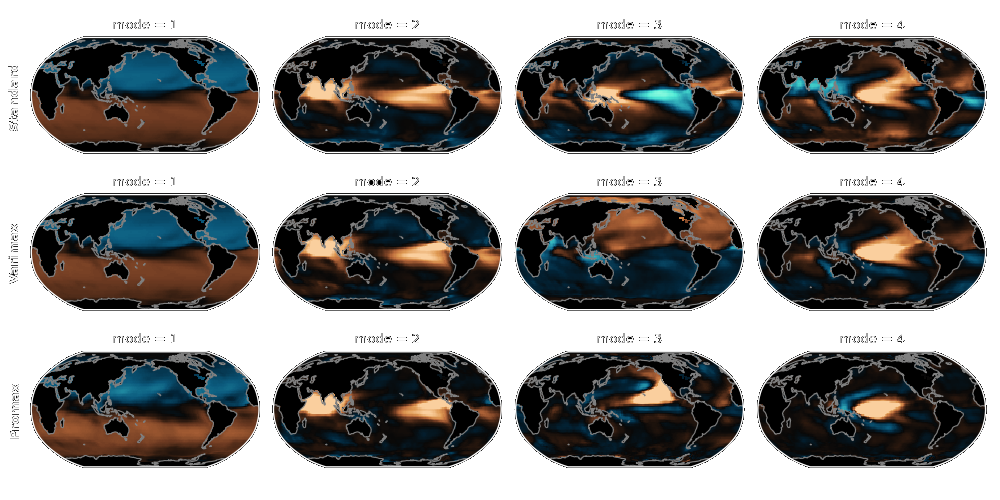

.. image:: img/example_sst_rotated_pca_light.png
    :class: only-light

==============
User Guide
==============

If you are new to xeofs, this is the place to start. Here, you will learn :doc:`why xeofs<011_why>` was created, what it can do for you, and how to :doc:`get started<013_quickstart>`.

Advantages of using xeofs:

- **Multi-Dimensional & Labeled Data:** Designed for xarray_ objects, xeofs applies dimensionality reduction to multi-dimensional data while maintaining data labels. It works with both DataArray and Dataset objects, providing output that matches the type of input, whether single or a list of xr.DataArray or xr.Dataset.
- **Dask-Integrated:** Supports large datasets via dask_ xarray objects.
- **Efficient:** Ensures computational efficiency, especially with large datasets, through randomized SVD.
- **Extensive Methods:** Offers various dimensionality reduction techniques. For more details, see the :doc:`API reference<03_api>`.
- **Handling Missing Values:** Can manage common cases where some features are masked out by NaN values, such as masked ocean or land cells.
- **Bootstrapping:** Provides a user-friendly interface for model evaluation using bootstrapping.
- **Modular:** Allows users to implement and incorporate new dimensionality reduction methods.

If you're eager to see it in action, check out the :doc:`basic example<013_quickstart>` to get started quickly. For more comprehensive demonstrations, explore our :doc:`example gallery<auto_examples/index>`.

.. toctree::
  :maxdepth: 3
  :hidden:

  user_guide/why
  user_guide/quickstart
  user_guide/labeled_data
  user_guide/dask_support
  user_guide/efficient
  user_guide/missing_values
  user_guide/model_evaluation
  user_guide/model_serialization
  user_guide/model_implementation
  user_guide/xeofs_comparison
  auto_examples/index

.. _xarray: https://docs.xarray.dev/en/stable/index.html
.. _dask: https://dask.org/

