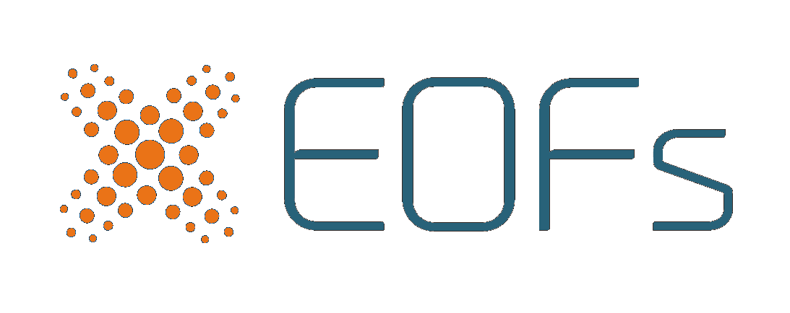
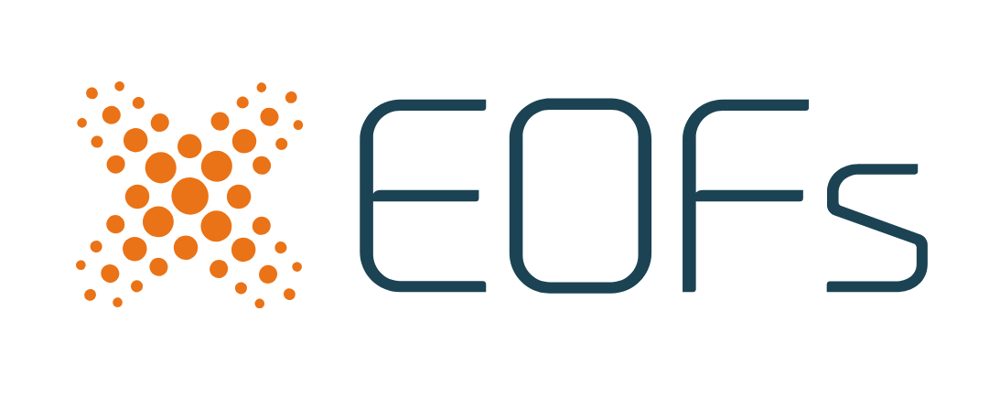

.. rst-class:: center

=====================================================
Extracting Patterns from Climate Data
=====================================================

.. toctree::
  :maxdepth: 3
  :hidden:

  content/user_guide/index
  content/user_guide/installation
  content/api_reference/index
  content/whats_new/CHANGELOG
  content/contributing

xeofs is a specialized Python package designed for dimensionality reduction in climate science, aimed at extracting meaningful patterns from large datasets. It provides eigenmethods such as Principal Component Analysis (EOF analysis) and several related variants. Seamlessly integrated with xarray_ and Dask_, xeofs enables efficient handling and scalable computation of large, multi-dimensional datasets. This integration makes advanced climate data analysis both accessible and efficient.

.. grid:: 2

    .. grid-item-card:: 
      :octicon:`repo;10em`
      :link: content/user_guide/index
      :link-type: doc
      :text-align: center

      **User Guide**

      Learn more about the package and its features.

    .. grid-item-card::
      :octicon:`gear;10em`
      :link: content/user_guide/installation
      :link-type: doc
      :text-align: center

      **Installation**

      Get started with xeofs in a few simple steps.

.. grid:: 2

    .. grid-item-card::
      :octicon:`search;10em`
      :link: content/api_reference/index
      :link-type: doc
      :text-align: center

      **API Reference**

      Explore the available functions and classes.

    .. grid-item-card::
      :octicon:`people;10em`
      :link: content/contributing
      :link-type: doc
      :text-align: center

      **Contributing Guide**

      Join the community and contribute to the project.

.. note:: 

    xeofs is currently in the early stages of development. 
    We welcome contributions and feedback from the community.

.. note:: 

    Version 3 has been released! Check out the :doc:`CHANGELOG<content/whats_new/CHANGELOG>` for more details. For users of previous versions, see the :doc:`migration guide<content/user_guide/migration_v3>`.

.. _xarray: https://docs.xarray.dev/en/stable/index.html
.. _Dask: https://dask.org/

