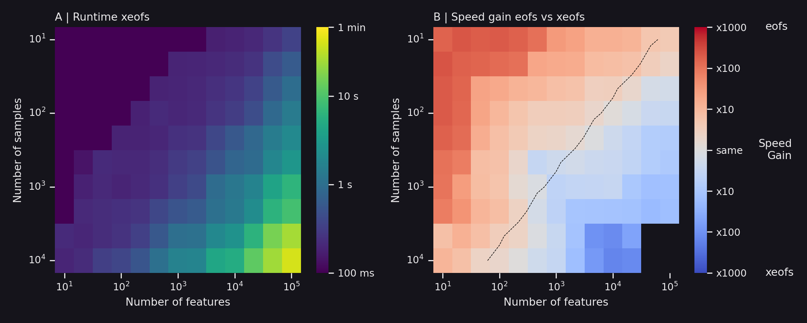

=============================================
Computationally Efficient
=============================================

Whether you're working with in-memory or out-of-memory data, xeofs ensures computational efficiency. This is achieved using randomized SVD, which is typically faster for large matrices than a full SVD. For more details, refer to the sklearn documentation_ on PCA.

A comparative analysis demonstrates the performance of xeofs against eofs_ on a standard laptop using a 3D dataset with time, longitude, and latitude dimensions. Results indicate that xeofs computes moderate datasets (10,000 samples by 100,000 features) in under a minute. While eofs is faster for smaller datasets, xeofs excels with larger datasets, offering significant speed advantages. The dashed line marks datasets with about 3 MiB; xeofs outpaces eofs above this size, whereas eofs is preferable for smaller datasets.

Comparison of computational times between xeofs and eofs for data sets of varying sizes

.. note::

    You can find the script to run the performance tests here_.

.. _eofs: https://ajdawson.github.io/eofs/
.. _here: https://github.com/xarray-contrib/xeofs/tree/main/docs/perf
.. _documentation: https://scikit-learn.org/stable/modules/generated/sklearn.decomposition.PCA.html
