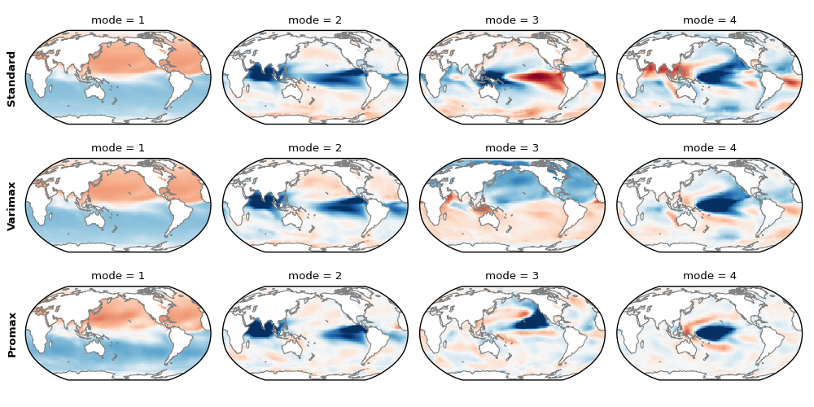

==============
User Guide
==============

If you are new to xeofs, this is the place to start. Here, you will learn :doc:`why xeofs<why>` was created, what it :doc:`can do <core_functionalities/index>` for you, and how to :doc:`get started<quickstart>`.

Advantages of using xeofs:

- :doc:`Multi-Dimensional & Labeled Data <core_functionalities/labeled_data>`: Designed for xarray_ objects, xeofs applies dimensionality reduction to multi-dimensional data while maintaining data labels. It works with both DataArray and Dataset objects, providing output that matches the type of input, whether single or a list of xr.DataArray or xr.Dataset.
- :doc:`Dask-Integrated <core_functionalities/dask_support>`: Supports large datasets via dask_ xarray objects.
- :doc:`Efficient <core_functionalities/efficient>`: Ensures computational efficiency, especially with large datasets, through randomized SVD.
- **Extensive Methods:** Offers various dimensionality reduction techniques. For more details, see the :doc:`API reference<../api_reference/index>`.
- :doc:`Handling Missing Values <core_functionalities/missing_values>`: Can manage common cases where some features are masked out by NaN values, such as masked ocean or land cells.
- :doc:`Bootstrapping <core_functionalities/model_evaluation>`: Provides a user-friendly interface for model evaluation using bootstrapping.
- :doc:`Modular <model_implementation>`: Allows users to implement and incorporate new dimensionality reduction methods.

If you're eager to see it in action, check out the :doc:`basic example<quickstart>` to get started quickly. For more comprehensive demonstrations, explore our :doc:`example gallery<../auto_examples/index>`.

Finally, if you're using xeofs in your academic work, please consider citing the software. For more information, see :doc:`how to cite<how_to_cite>`.

.. toctree::
  :maxdepth: 3
  :hidden:

  why
  quickstart
  core_functionalities/index
  model_implementation
  xeofs_comparison
  ../auto_examples/index
  how_to_cite

.. _xarray: https://docs.xarray.dev/en/stable/index.html
.. _dask: https://dask.org/

